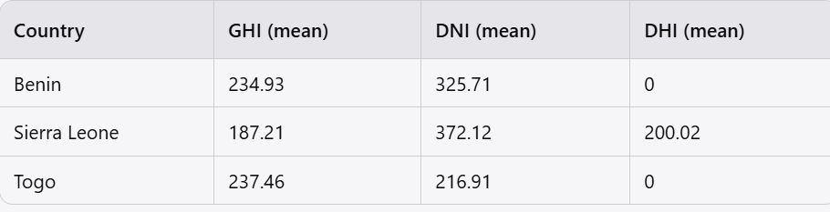

# Solar Challenge Week 0


## Overview
This project analyzes solar farm data from Benin, Sierra Leone, and Togo to identify high-potential regions for solar installation. The challenge involves performing exploratory data analysis (EDA) to inform strategic investments for MoonLight Energy Solutions.

## Table of Contents
- [Solar Challenge Week 0](#solar-challenge-week-0)
  - [Overview](#overview)
  - [Table of Contents](#table-of-contents)
  - [Environment Setup](#environment-setup)
  - [Usage](#usage)
  - [Data Overview](#data-overview)
  - [Data Structure](#data-structure)
  - [Analysis](#analysis)
  - [Results](#results)
  - [Key Observations](#key-observations)
  - [Recommendations](#recommendations)

## Environment Setup
1. Clone the repository.
   ```bash
   git clone https://github.com/Amdemichael/Solar-Data-Discovery-optimization.git
   cd Solar-Data-Discovery-optimization
   ```
2. Create a virtual environment:
   - `python -m venv amde`
   - Activate with `source venv/bin/activate` (Linux/Mac) or `venv\Scripts\activate` (Windows).
3. Install dependencies:
   - `pip install -r requirements.txt`
  ## Usage
1. Launch Jupyter Notebook:
   ```bash
   jupyter notebook
   ``` 
2. Open the relevant notebooks (benin_eda.ipynb, compare_countries.ipynb) to view the analysis and results.

## Data Overview
The dataset contains measurements of:
- Global Horizontal Irradiance (GHI): Total solar radiation received per square meter on a horizontal surface.
- Direct Normal Irradiance (DNI): Solar radiation received per square meter on a surface perpendicular to the rays of the sun.
- Diffuse Horizontal Irradiance (DHI): Solar radiation received per square meter on a horizontal surface that does not arrive directly from the sun.

## Data Structure
- Timestamp: Date and time of each observation.
- GHI, DNI, DHI: Solar radiation measurements.
- Other Variables: Ambient temperature, relative humidity, wind speed, and precipitation.

## Analysis
- Data Profiling: Summary statistics, missing-value reports, and outlier detection.
- Exploratory Data Analysis: Visualizations including time series plots, correlation heatmaps, and distribution analyses.
- Cross-Country Comparison: Boxplots and statistical tests (e.g., ANOVA) to assess differences in solar potential.

## Results
Summary Statistics


## Key Observations
- Benin has the highest mean GHI, indicating it as the most promising country for solar investments.
- Sierra Leone shows the highest mean DNI, which is critical for direct solar technologies.

## Recommendations
- Focus on solar installation projects in Benin due to its superior GHI.
- Consider Sierra Leone for technologies optimized for direct sunlight.